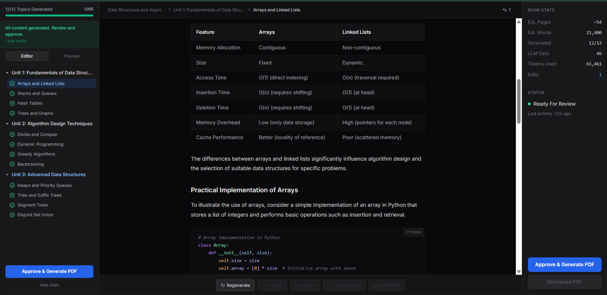

# AI Ebook Generator

> **Turn a topic into a full textbook.** One input → ~250 pages, PDF + DOCX. ~186 LLM calls, checkpoint/resume, batch from CSV. ~₹10 per book.

[](LICENSE)
[](https://nodejs.org/)
[](https://www.typescriptlang.org/)
[](https://nextjs.org/)
[](https://expressjs.com/)
[](https://www.docker.com/)
[](https://openai.com/)
[](#)
[](https://drive.google.com/)

---

## Features

- **One topic → full book:** Cover, copyright, preface, TOC, 10 units (intro + 6 subtopics + summary + 20 MCQs each), capstones, case studies, glossary, bibliography.
- **PDF + DOCX** export; optional **Google Drive** upload.
- **Batch mode:** CSV with title (and optional author/ISBN) → one ebook per row. Checkpoint/resume and automatic retries so long runs don’t lose progress.
- **Docker-first:** Single image for API + batch; run locally or on a server (e.g. EC2).

---

## Why this project

For **educators**, **course creators**, and **content teams** who need many structured textbooks or manuals without writing them by hand. The pipeline keeps structure consistent (units, exercises, summaries) and cost low (~₹10/book at current API pricing). Use the web UI for single books or the CLI for hundreds from a CSV.

---

## How it works

1. **You provide** a topic (e.g. “Docker for beginners”) and optionally author/ISBN (for batch).
2. **Structure** is generated first (units, subtopics, capstones, case studies) in one LLM call.
3. **Content** is built unit by unit: intro → subtopics (with chained context) → micro-summaries → unit summary → end-summary → 20 MCQs (two calls).
4. **Post-units:** capstones, case studies, glossary, bibliography (parallel where possible).
5. **Assembly:** Markdown is stitched, then rendered to HTML and exported as **PDF** (Puppeteer) and **DOCX** (html-to-docx). Batch uploads to Google Drive.

```mermaid
flowchart LR
    subgraph Entry["Entry"]
        direction TB
        WebUI["Web UI"]
        BatchCLI["Batch CLI"]
    end

    subgraph API["Express API"]
        direction TB
        Routes["Routes"]
        SessionStore["Session Store"]
    end

    subgraph Orch["Orchestrator"]
        direction LR
        P1["Structure"] --> P2["Preface"] --> P3["Units"] --> P4["Capstones"]
        P4 --> P5["Case Studies"] --> P6["Glossary"] --> P7["Bibliography"] --> P8["Assembly"]
    end

    subgraph Export["Export"]
        direction TB
        MD["Markdown"] --> HTML["HTML"]
        HTML --> PDF["PDF"]
        HTML --> DOCX["DOCX"]
    end

    subgraph Out["Output"]
        direction TB
        Drive["Google Drive"]
        Download["Direct Download"]
    end

    OpenAI["OpenAI"]

    WebUI -->|"POST /api/generate"| Routes
    BatchCLI -->|"direct"| SessionStore
    Routes --> SessionStore
    SessionStore --> Orch

    Orch <-.->|"~186 LLM calls"| OpenAI

    P8 --> MD

    PDF -->|"batch"| Drive
    DOCX -->|"batch"| Drive
    PDF -->|"web"| Download
```



Full pipeline: [ARCHITECTURE.md](ARCHITECTURE.md).

---

## Example output structure

```
Cover → Copyright (publisher, ©, ISBN) → Preface → Table of contents
Unit 1: [Title]
  Intro → 1.1–1.6 subtopics → Unit summary → 20 MCQs
Unit 2 … Unit 10
Capstone projects (2) → Case studies (3) → Glossary → Bibliography
```

~250 pages, academic tone, tables and code blocks where appropriate.

---

## Quick demo (one short book in ~2 min)

Uses **debug mode** (3 units, 4 subtopics) so you can see the full flow without waiting for a full book.

```bash
git clone <your-repo-url>
cd ebook-generator
cp apps/api/.env.example apps/api/.env
# Set OPENAI_API_KEY in apps/api/.env

docker compose build app
docker compose run --rm -e BATCH_PROGRESS_FILE=/tmp/demo-progress.json -e DEBUG_MODE=true app /docker-entrypoint.sh batch /data/batch-sample.csv
```

Generated PDF + DOCX are uploaded to your Drive if `GDRIVE_*` is set; otherwise the run still completes and you can inspect output in the pipeline.

---

## Screenshots



*Editor view: unit/subtopic navigation, content viewer, book stats, and Approve & Generate PDF.*

---

## Quick start

**Local**

```bash
npm install
cp apps/api/.env.example apps/api/.env
# Set OPENAI_API_KEY in apps/api/.env

cd apps/api && npm run dev          # Terminal 1
cd apps/frontend && npm run dev     # Terminal 2
```

Open http://localhost:3000.

**Docker**

```bash
cp apps/api/.env.example apps/api/.env
# Edit apps/api/.env with OPENAI_API_KEY (and Drive vars for batch)

docker compose up -d --build
```

App at http://localhost:3000.

---

## Bulk generation (batch CLI)

CSV format: **column A** = title, **B** = optional author, **C** = optional ISBN.

```csv
Title of the Book,Author,ISBN
Advanced Python Programming,Dr. Jane Smith,979-8-12345-678-9
```

**One-time Drive setup:** Set `GDRIVE_CLIENT_ID`, `GDRIVE_CLIENT_SECRET` in `.env`. Start API, open http://localhost:4000/auth/google, grant access, copy the refresh token into `GDRIVE_REFRESH_TOKEN`. Set `GDRIVE_PDF_FOLDER_ID` and `GDRIVE_DOC_FOLDER_ID`.

**Run batch**

```bash
# Docker (CSV in apps/api is mounted at /data)
docker compose up -d
docker compose exec app /docker-entrypoint.sh batch /data/batch-sample.csv
```

**Progress:** Batch uses checkpoint/resume and retry rounds. See [CHECKPOINT_STORAGE.md](CHECKPOINT_STORAGE.md) for where progress is stored.

**Duplicate prevention:** With `BATCH_SKIP_IF_IN_DRIVE=true` (default), the CLI checks Drive before generating—if PDF and DOCX already exist, the book is skipped. Set `BATCH_UPDATE_IF_EXISTS=true` to overwrite existing files instead of creating duplicates.

---

## Environment

| Variable | Purpose |
|----------|---------|
| `OPENAI_API_KEY` | **Required.** OpenAI API key |
| `OPENAI_MODEL` / `LIGHT_MODEL` | Model (default: gpt-4o-mini) |
| `DEBUG_MODE` | `true` = 3 units, 4 subtopics (testing); unset/false = full book |
| `GDRIVE_CLIENT_ID`, `GDRIVE_CLIENT_SECRET`, `GDRIVE_REFRESH_TOKEN` | For batch Drive upload |
| `GDRIVE_PDF_FOLDER_ID`, `GDRIVE_DOC_FOLDER_ID` | Drive folder IDs for PDFs and DOCXs |
| `BATCH_SKIP_IF_IN_DRIVE` | Skip if PDF+DOCX already in Drive (default: true) |
| `BATCH_UPDATE_IF_EXISTS` | Overwrite existing file instead of creating duplicate (default: false) |

See `apps/api/.env.example` for optional vars (timeouts, retry rounds, etc.).

---

## Deploy (e.g. AWS)

Use an instance with Docker (e.g. t3.medium or t3.large for batch). Clone repo, set `apps/api/.env`, then:

```bash
docker compose up -d --build
# Run batch via SSH; restrict ports via Security Groups.
```

---

## License

[MIT](LICENSE).

For full technical details, see [ARCHITECTURE.md](ARCHITECTURE.md).
